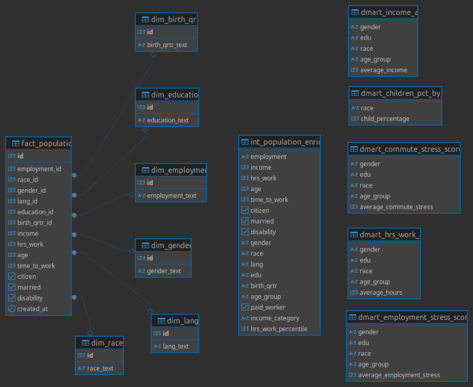

# End-to-End ACS Data Pipeline

## Big Data Engineering Project

### Overview

This project demonstrates an end-to-end data pipeline built for processing the **American Community Survey (ACS)** dataset. The pipeline exercises key data engineering skills, including Python, SparkSQL, PySpark, asynchronous processing, Docker, and Kubernetes (Minikube).

### Dataset

* **American Community Survey (ACS)**: A rich dataset with demographic, economic, and housing data from the U.S. population.
* Source: [https://www.kaggle.com/datasets/sirishasingla1906/american-community-survey](https://www.kaggle.com/datasets/sirishasingla1906/american-community-survey)

### Summary

The pipeline adopts a **Bronze / Silver / Gold architecture**, with raw data in the data lake, cleaned Silver data in the staging area (pre-Spark), and Gold data in the PostgreSQL data warehouse.

---

### Architecture

#### Bronze / Silver / Gold Data Flow

The pipeline implements a clear **Bronze / Silver / Gold pattern**, as commonly seen in modern data engineering:

* **Bronze Layer** → Raw ingested CSVs stored in `data/data_lake/` (simulated multi-source ingestion).
* **Silver Layer** → Cleaned, standardized data stored in `data/staging_area/` (pre-Spark cleaning via asynchronous Python).
* **Gold Layer** → Core modeled data (dimension + fact tables) and business data marts in PostgreSQL, populated via Spark.

##### Detailed Description

* **Bronze Layer** → The `data/data_lake/` folder holds raw CSV chunks produced by `simulate_ingestion.py`. These represent ingested data from source(s), unprocessed and without schema enforcement.

* **Silver Layer** → The `data/staging_area/` folder holds cleaned, standardized data prepared by the asynchronous `cleaning.py` module. This cleaning step is performed *before* Spark — demonstrating that the Silver layer can be implemented in Python workflows, not only inside Spark. This step involves cleaning individual files asynchronously using pandas.

* **Gold Layer** → The cleaned Silver data feeds the Spark pipeline, which loads:

  * **Core Gold tables** (dimension and fact tables) into PostgreSQL, forming a Star Schema.
  * **Analytical Gold data marts** in PostgreSQL — ready for business reporting and visualization.

This structure follows a proven **Bronze → Silver → Gold flow**, with a deliberate design choice to perform Silver cleaning asynchronously before Spark. The architecture is modular, reproducible, and scalable.

---

### Execution Flow

1. **Simulate Ingestion**

   * Split large CSV source into multiple raw chunks (Bronze).
2. **Async Cleaning**

   * Perform cleaning & standardization asynchronously in Python/Pandas (Silver).
3. **Database Initialization**

   * Initialize PostgreSQL database and create dimension + fact tables.
4. **Spark Processing**

   * Load Silver data, populate DIM + FACT tables (Core Gold).
   * Build analytical marts (Gold).

---

### Database Schema

The `int_population_enriched` table acts as an enriched intermediate flat table from which all final data marts are derived.



### Module Overview

| Module                  | Purpose                                                                                                       |
| ----------------------- | ------------------------------------------------------------------------------------------------------------- |
| `simulate_ingestion.py` | Simulates ingestion by splitting the starting CSV into multiple chunks and into the Data Lake (Bronze layer). |
| `cleaning.py`           | Asynchronously cleans each chunk and stores the results in the staging area (Silver layer).                   |
| `clean_up.py`           | Utility module to clean *staging_area* and *data_lake* folders before/after pipeline runs.                    |
| `db_init.py`            | Initializes the PostgreSQL database: creates dimension and fact tables.                                       |
| `spark_pipeline.py`     | Runs the Spark pipeline: loads Silver data, populates DIM/FACT tables, and builds data marts (Gold layer).    |
| `main.py`               | Orchestrates the entire pipeline: clean-up, ingestion, async cleaning, DB init, Spark pipeline.               |
| `logger.py`             | Configures consistent logging across all pipeline steps.                                                      |

---

### How to Run the Pipeline

1. Clone the repository and navigate to the project root:

```bash
git clone https://github.com/letsiki/end-to-end-data-pipeline-acs.git
cd end-to-end-data-pipeline-acs
```

2. Ensure you have:

   * Minikube and kubectl installed ([Installation instructions](https://minikube.sigs.k8s.io/docs/start/))
   * No need to build the Dockerfile, the image will be pulled from Docker Hub.

3. Start Minikube:

```bash
minikube start
```

4. Apply Kubernetes manifests:

```bash
kubectl apply -f k8s/
```

5. Monitor the pipeline execution:

```bash
kubectl get pods --watch
```

Wait until the pipeline-job has finished, then press CTRL-C to exit.

6. check the execution logs

```bash
kubectl logs <your-pipeline-pod-name>
```

Here you will find the complete execution logs. In particular, you can verify that the cleaning module, processed all files asynchronously (they will appear unordered).

7. Retrieve pipeline results:

* Final DIM/FACT tables and data marts will be available in the PostgreSQL database (`acs_dataset` DB) running in your Minikube cluster.

* Intermediate data files can (optionally) be retrieved via the mapped volume `app/data/`, which contains:

  * `data/data_lake/` -> raw ingested CSVs
  * `data/staging_area/` -> cleaned Silver layer data (Pickles)

#### To copy the entire `app/data/` folder from the pod to your local machine

1. Find your pipeline pod name:

```bash
kubectl get pods
```

2. Copy the `app/data/` folder to your local machine (into `./data`):

```bash
kubectl cp <your-pipeline-pod-name>:/app/data ./data
```

→ The contents of `app/data/` will be copied to `./data/` in your local project folder.

---

### How to Inspect Results in PGAdmin

1. Get Minikube IP:

```bash
minikube ip
```

2. Open PGAdmin:

```
http://<minikube-ip>:30800
```

3. Login:

* **Username**: `postgres@user.gr`
* **Password**: `password`

4. Add new server:

* Name: any (e.g. `Postgres DWH`)
* **Connection tab**:

  * Hostname: `postgres`
  * Username: `user`
  * Password: `password`

5. Explore database:

* Navigate: \<server-name\> -> Databases -> acs_dataset.
* Open **Query Tool** (Tools → Query Tool) to run SQL queries on dimension tables, fact table, and data marts.

---

### Additional Notes

* The pipeline is implemented in **Python 3.12.3** and uses **PySpark**, but **no manual Python execution is required** — it is fully orchestrated via Kubernetes / Minikube.
* Logs are written to the console and can be retrieved via `kubectl logs`.
* The PostgreSQL service is exposed within the cluster and can be connected to externally (via PgAdmin or psql client) using the `postgres-service.yaml` configuration.

---

### Key Technologies

* **Python 3.12.3**: Core pipeline orchestration & asynchronous cleaning.
* **PySpark & SparkSQL**: Data transformation & enrichment.
* **PostgreSQL**: Final data warehouse.
* **Docker**: Containerization of the full application.
* **Kubernetes (Minikube)**: Orchestration of the pipeline in a local cluster.

---

### Design Choices

* The pipeline leverages **asynchronous Python** to clean data before Spark to:

  * Optimize Spark workload.
  * Demonstrate flexible Silver layer implementation.
  * Enable modular architecture.

* **Star Schema** is used to structure the core DWH model (dim/fact), this will act as the *source of truth* for the analytical workloads.
* A *created_at* field has been added to the fact table, for future incremental load support.
* All **FK**'s have been *indexed* in the fact tables, for faster JOIN operations.

* **Intermediate Table** is a flattened table, enriched with groupings, from which, marts will be derived.

* **Data Marts** are created as dedicated tables for business-friendly reporting metrics.

---

### Conclusion

This project demonstrates a full end-to-end data pipeline based on a well-structured **Bronze / Silver / Gold architecture** pattern. It emphasizes modular design, asynchronous processing, and scalable data engineering practices.

---

### Line of Thinking

My approach to this project was to apply professional data engineering principles while ensuring clarity and modularity:

* I adopted a **Bronze / Silver / Gold architecture** to mirror real-world data pipelines.
* I intentionally performed **Silver layer cleaning asynchronously before Spark** to demonstrate flexibility and modular design.
* I structured the data warehouse using a **Star Schema** (dimension and fact tables), enabling both core modeling and analytical reporting.
* I used **Spark** primarily for transformation, enrichment, and data mart creation, showcasing its capabilities for handling large-scale processing.
* The pipeline is fully **containerized** and **orchestrated** with Kubernetes (Minikube), demonstrating deployability and scalability.

Overall, I aimed to balance **engineering best practices** with **pragmatic implementation**, creating a pipeline that is clear, testable, and easy to extend.
